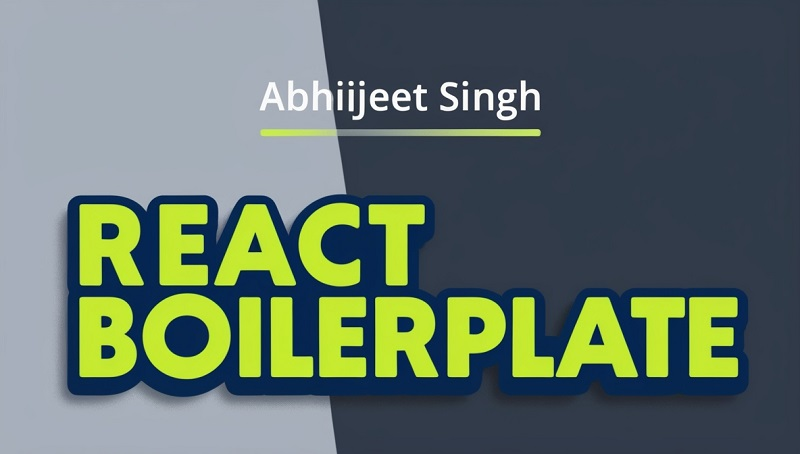

## Screenshot



# React Boilerplate - Simple and Scalable

A **React Boilerplate** to kickstart your projects with a simple, scalable, and powerful setup. It comes pre-configured with authentication context, protected routes, scaffolding, SEO optimization, and responsive design. The boilerplate is easy to customize and includes modern CSS and Webpack configurations for streamlined development.


## Features

- **Simple and Scalable**: A project structure designed for simplicity and scalability, suitable for both small and large applications.
- **AuthContext & Protected Routes**: In-built authentication context for managing user authentication and route protection.
- **Scaffolding**: Pre-built directory structure to help you organize your project better.
- **Responsive & Instant Feedback**: Optimized for mobile responsiveness and instant UI updates.
- **SEO Friendly**: Out-of-the-box support for server-side rendering and SEO optimization.
- **Webpack Development Setup**: Pre-configured Webpack setup for an optimal development environment.
- **Next Gen & Customizable CSS**: Support for modern CSS features and customization options.

---

## Directory Structure

```bash
├── /public             # Static files like HTML, favicon, etc.
├── /src                # Source files for the project
│   ├── /components     # Reusable UI components
│   ├── /css            # Custom stylesheets and CSS modules
│   ├── App.js          # Main App component
│   └── AuthContext.js  # Context API for managing authentication
│   └── Helper.js       # Utility/helper functions
│   └── index.js        # Entry point of the application
│   └── Protected.js    # Component to handle protected routes
├── .gitignore          # Files to be ignored in version control
├── package.json        # Project metadata and dependencies
└── README.md           # Documentation for the project
```
---

##Installation
## 1.Clone the repository:
```bash
git clone https://github.com/yourusername/react-boilerplate.git
```
## 2.Navigate to the project directory:
```bash
cd react-boilerplate
```
## 3. First time run
```bash 
npm init
```
## 4. Install dependencies:
```bash 
npm install
```
## 5. Run the development server:
```bash 
react-scripts start
```
---

## Webpack Setup

The boilerplate uses **Webpack** for bundling and development. The Webpack configuration is optimized for React development, ensuring fast reloads and efficient builds. 

You can customize the Webpack configuration as per your needs by editing the `webpack.config.dev.js` file located in the project root. This file contains settings for module bundling, file processing, and development server options.

To modify Webpack settings for production or development:

1. Open the `webpack.config.dev.js` file for development configurations.
2. Adjust the options such as entry points, output directories, loaders (e.g., Babel for JavaScript and CSS loaders), and plugins.
3. Restart the development server to apply the new configurations. 


